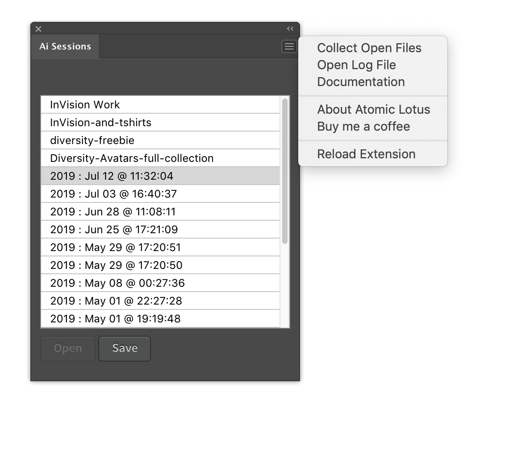

***
#### Support Open Source Development

Donations help open source developers, who are often self-employed freelancers, continue to create free resources. You can donate to this project using the button below.

***

# About

Ai-Sessions is an extension for Adobe Illustrator that will save the file paths of all open Illustrator files in {MY_DOCUMENTS}/ai-sessions/ai-YYYY-MM-DD-r[0-9].json so you can easily re-open open documents in your "work session". The file paths are saved in a JSON object. 

# Features

1. Give each session a custom name for easy recognition
2. Session tooltips for longer descriptions (see image below)
   
3. Collection open documents into a single folder
      

# CREDITS
 
You are free to use, modify, and distribute this script as you see fit as long as you maintain the copyright notices in the original source files. A link to the [Atomic Lotus website](https://atomiclotus.net) would be greatly appreciated as well. You must also extend the same license to users of your code. This is not to say that your original code must be open source, but the code from this project must remain free and open forever.

Scott Lewis
* scott@atomiclotus.net
* https://atomiclotus.net

# DISCLAIMER OF LIABILITY

THIS SCRIPT IS OFFERED AS-IS WITHOUT ANY WARRANTY OR GUARANTEES OF ANY KIND. YOU USE THIS SCRIPT COMPLETELY AT YOUR OWN RISK AND UNDER NO CIRCUMSTANCES WILL THE DEVELOPER AND/OR DISTRIBUTOR OF THIS SCRIPT BE HELD LIABLE FOR DAMAGES OF ANY KIND INCLUDING LOSS OF DATA OR DAMAGE TO HARDWARE OR SOFTWARE. IF YOU DO NOT AGREE TO THESE TERMS, DO NOT USE THIS SCRIPT.

# Installation

This extension has not yet been submitted to Adobe Exchange (but soon). For now, you can download the ZXP file in this repository and use [Anastasiy's Extension Manager](https://install.anastasiy.com) to install. Anastasiy's Extension Manager is a fantastic app. 

